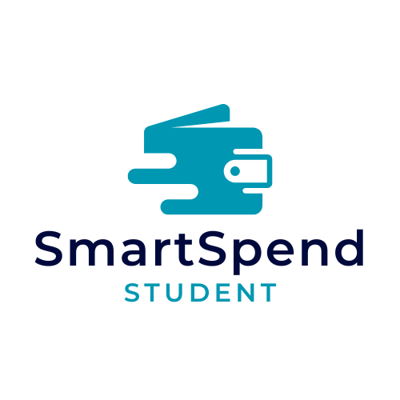

# SmartSpend Student



## Έξυπνη Διαχείριση Φοιτητικού Προϋπολογισμού

Αυτή η εφαρμογή βοηθά τους φοιτητές να διαχειριστούν τον προϋπολογισμό τους και τις δαπάνες τους με έξυπνο και οργανωμένο τρόπο. Περιλαμβάνει εργαλεία για την παρακολούθηση και την ανάλυση των εξόδων, με στόχο την καλύτερη οικονομική διαχείριση.

---

## 🚀 Οδηγίες Εκτέλεσης Τοπικά

Για να τρέξεις την εφαρμογή στον υπολογιστή σου, ακολούθησε τα παρακάτω βήματα:

### 1. Κλωνοποίηση του Repository

Αρχικά, κλωνοποίησε το repository στον τοπικό σου υπολογιστή:

```bash
git clone https://github.com/georgekrds/SmartSpend-Student.git
cd SmartSpend-Student
```

### 2. Δημιουργία και Ενεργοποίηση Εικονικού Περιβάλλοντος (Προαιρετικά)

Για να δημιουργήσεις και να ενεργοποιήσεις ένα εικονικό περιβάλλον Python (προαιρετικά), ακολούθησε τα παρακάτω βήματα:

#### Σε Windows:

```bash
python -m venv venv
venv\Scriptsctivate
```

#### Σε MacOS/Linux:

```bash
python3 -m venv venv
source venv/bin/activate
```

### 3. Εγκατάσταση των Εξαρτημάτων

Αφού ενεργοποιήσεις το εικονικό περιβάλλον, εγκατέστησε τις απαιτούμενες βιβλιοθήκες που αναφέρονται στο αρχείο `requirements.txt`:

```bash
pip install -r requirements.txt
```

### 4. Εκκίνηση του Backend

Για να εκκινήσεις την εφαρμογή, χρησιμοποίησε την παρακάτω εντολή:

```bash
python app.py
```

Αφού ολοκληρωθούν τα παραπάνω βήματα, άνοιξε τον browser στη διεύθυνση:  
`http://127.0.0.1:5000`

---

## 🔧 Απαιτήσεις

Για την εκτέλεση της εφαρμογής τοπικά, απαιτούνται οι εξής βιβλιοθήκες και εκδόσεις:

- Python 3.x
- Flask
- pandas
- numpy
- και άλλες βιβλιοθήκες (όλες αναφέρονται στο `requirements.txt`)

Αν δεν έχεις εγκαταστήσει τις βιβλιοθήκες, μπορείς να τις εγκαταστήσεις χρησιμοποιώντας την εντολή `pip install -r requirements.txt`.

---

## 🛠 Συνεισφορά

Αν θέλεις να συνεισφέρεις στην ανάπτυξη της εφαρμογής, ακολούθησε τα παρακάτω βήματα:

1. Κάνε fork το repository.
2. Δημιουργήστε ένα νέο branch για την αλλαγή που θέλεις να κάνεις.
3. Κάνε commit τις αλλαγές σου και ανοίξτε ένα Pull Request.

---

## 📄 Άδεια Χρήσης

Αυτή η εφαρμογή είναι ανοιχτού κώδικα υπό την άδεια [MIT License](https://opensource.org/licenses/MIT).

---
